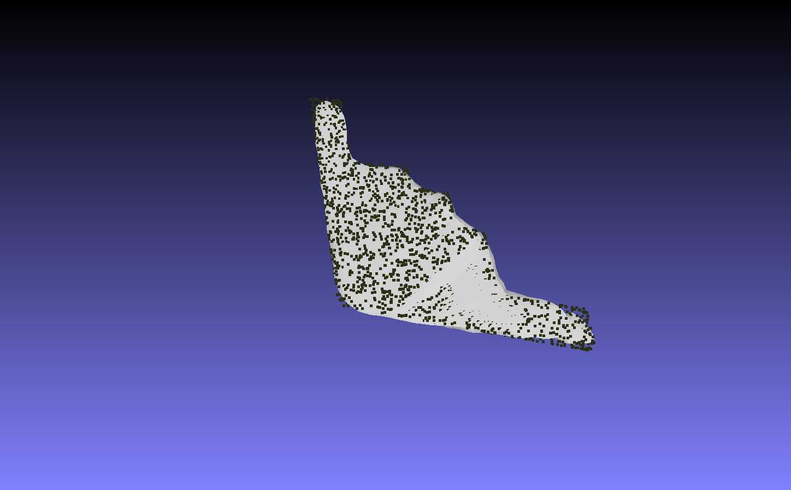
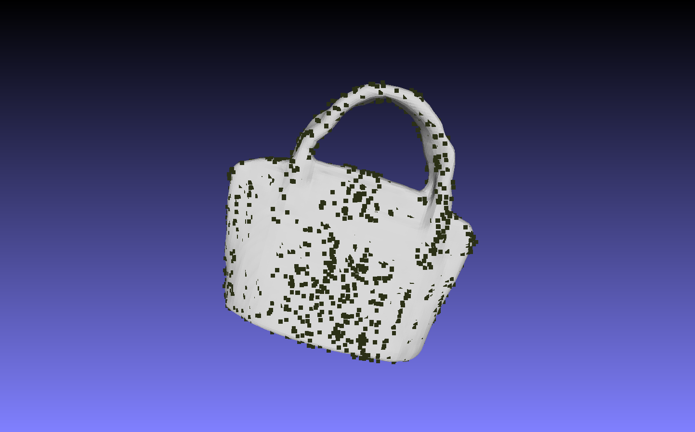
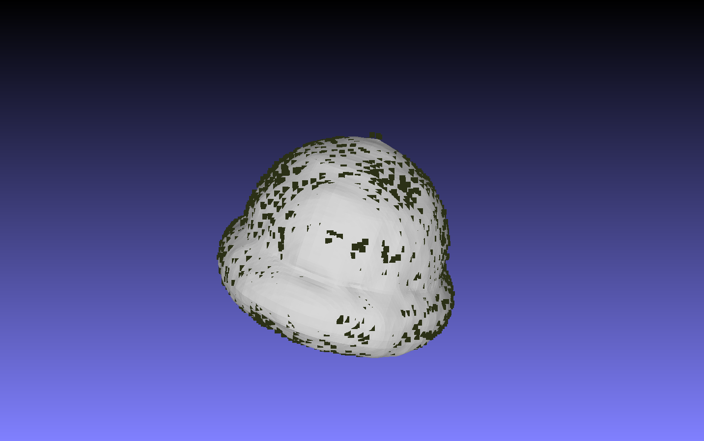

Pytorch re-Implementation of Convolutional Occupancy networks. Based on the paper:

  > Convolutional Occupancy Networks](https://arxiv.org/abs/2003.04618)\
  > Songyou Peng, Michael Niemeyer, Lars Mescheder, Marc Pollefeys, Andreas Geiger\
  > arXiv:2003.04618

  Experiments on extending Convolutional Occupancy networks to semantic implicit representations for semantic scene completion. 

  The complete resontructed results are in the in the `recon_mesh.zip` folder.The results for semantic reconstruction will be added in a few weeks.
  Sample meshes reconstructed can be seen below. Semantic meshes will be commited in a 2 weeks after CVPR rebuttal.

### Airplane

### Bag

### Car

### Chair

### Airplane

  ### To-DO
- [x] Commit visualization for semantic meshes.
- [x] Finish experiments on Semantic-KITTI
   

